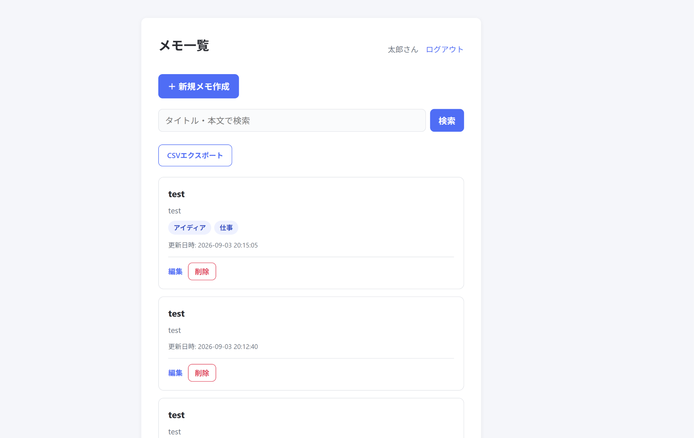
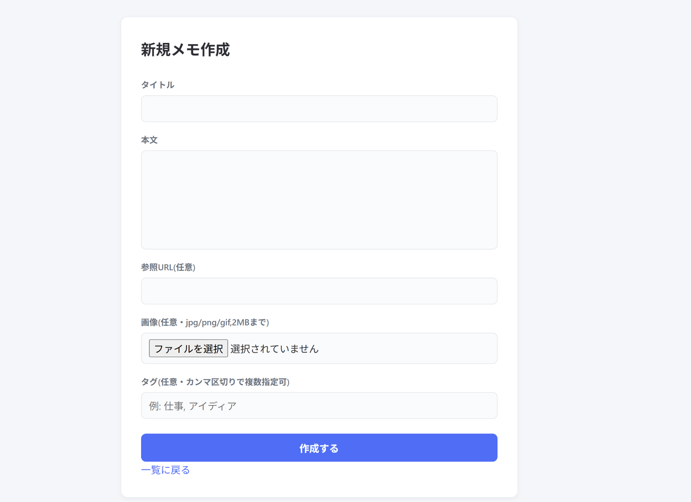

# Memo App

PHP + MySQL(Docker)で構築した、シンプルなメモ管理アプリです。会員登録・ログイン機能を備え、ユーザーごとにメモの作成・編集・削除・検索ができます。

## 機能一覧

- 会員登録・ログイン・ログアウト機能
- メモの新規作成・一覧表示・詳細表示・編集・削除(CRUD)
- 画像アップロード機能(jpg/png/gif、2MBまで)
- タグ機能(複数タグ付け、既存タグの再利用に対応した多対多リレーション)
- キーワード検索機能(タイトル・本文の部分一致)
- ページネーション機能
- メモのCSVエクスポート機能
- オブジェクト指向によるMemo・Tagクラスへのリファクタリング

本プロジェクトはDockerコンテナ(MySQL)上のデータベースと、PHPの組み込みサーバーで動作します。

## スクリーンショット

| メモ一覧画面                            | 新規作成画面                                 |
| --------------------------------------- | -------------------------------------------- |
|  |  |

## 環境構築

```bash
git clone https://github.com/kazuyuki-a-dev/memo-app.git
cd memo-app
docker-compose up -d
```

MySQLコンテナの起動完了までに時間がかかることがあります。数秒待ってから、PHPサーバーを起動してください。

```bash
php -S localhost:8000
```

`docker-compose.yml`実行時に`database/schema.sql`が自動的に読み込まれ、`users` / `memos` / `tags` / `memo_tag`テーブルが作成されます。

## 👤 動作確認

`http://localhost:8000/register.php` から新規ユーザー登録を行うことで、動作確認ができます(テスト用の初期ユーザーは用意していません)。

## 実行環境

### Docker環境

- Docker / Docker Compose
- MySQL 8.0
- PHP 8.x(組み込みサーバー)

### ホストOS

macOS / Windows / Linux(Dockerが動作する環境)

### 推奨ブラウザ

Chrome / Firefox / Edge(最新バージョン)

## 接続先一覧

- アプリ: http://localhost:8000
- MySQL: 127.0.0.1:3306(ユーザー名: memo_user / DB名: memo_db)

## 🛠 データベース設計

| テーブル名 | 概要                                                     |
| ---------- | -------------------------------------------------------- |
| users      | ユーザー情報(名前・メールアドレス・ハッシュ化パスワード) |
| memos      | メモ本体(タイトル・本文・URL・画像パス・所有ユーザー)    |
| tags       | タグ名のマスタ                                           |
| memo_tag   | memosとtagsを紐付ける中間テーブル(多対多)                |

主な設計方針:

- すべてのSQLで、操作対象が「ログイン中ユーザー自身のデータであること」を`WHERE user_id = :user_id`で必ず検証
- `memo_tag`は`memos`削除時に`ON DELETE CASCADE`で自動的に紐付けが削除される
- タグの更新は、既存の紐付けを一旦削除してから作り直す方式

## 作成者

作成者: [kazuyuki asari]
GitHub: https://github.com/kazuyuki-a-dev
